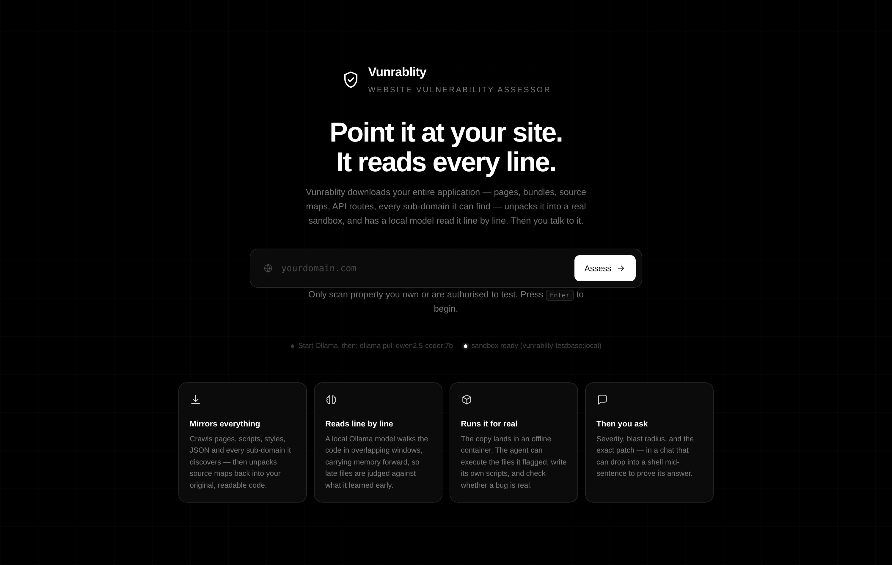
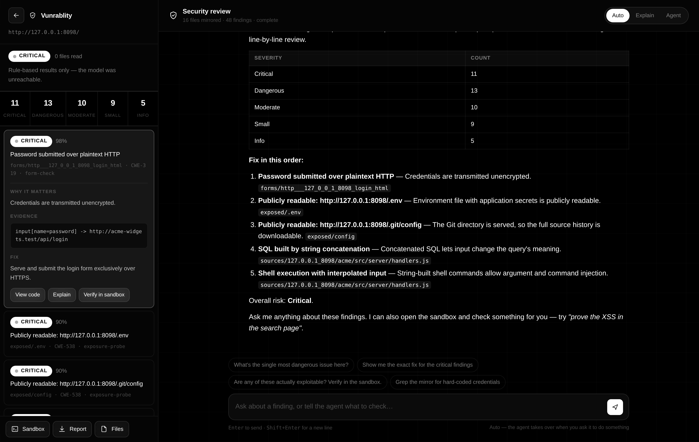
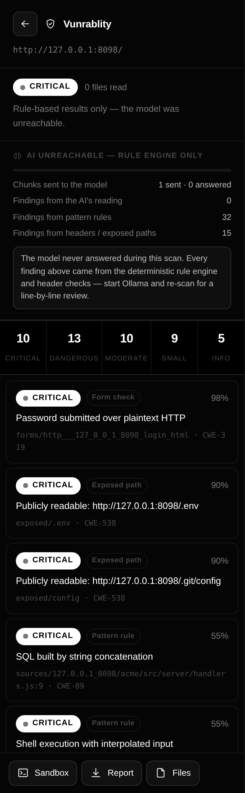

# Vunrablity

A website vulnerability assessor. Give it a URL. It downloads your entire
application, unpacks it into a real sandbox, has a local model read it line by
line, and then lets you talk to that model about what it found — including
letting it run commands in the sandbox to prove or disprove its own claims.

```
  URL  ──▶  mirror  ──▶  organise  ──▶  read every line  ──▶  chat + agent
           (crawler)     (inventory)    (Ollama + rules)      (sandbox)
```







---

## What it actually does

**1. Downloads everything.** Not just the landing page. The crawler walks
pages, scripts, stylesheets, JSON, images, fonts, `robots.txt`, `sitemap.xml`,
and every sub-domain it discovers on the way. It scrapes URLs out of JavaScript
string literals, `fetch`/`axios`/XHR call sites, and CSS `url()` rules — so
API routes that never appear in a link still end up in the inventory.

**2. Recovers your original source.** If your bundles ship `.js.map` files, it
unpacks `sourcesContent` back into the pre-minified, pre-bundled files you
actually wrote. That is usually where the real bugs live, and it is also a
finding in its own right.

**3. Probes for the classics.** `.env`, `.git/config`, `phpinfo.php`,
`/actuator/env`, database dumps, `swagger.json`. A `200` with real content is
recorded as a finding on the spot. GET requests only — it asks politely and
notes what the server volunteers.

**4. Reads every line.** A local Ollama model walks each file in overlapping
windows of ~120 lines, each labelled with absolute line numbers. It carries a
memory across the whole scan — facts it established, files it summarised,
findings it already recorded — so file 200 is judged in the context of what it
learned in file 3. A deterministic rule engine (60+ patterns) runs first and
hands the model its hits as hints to confirm, downgrade, or reject.

**5. Grades and explains.** Every finding gets a severity — *Critical*,
*Dangerous*, *Moderate*, *Small*, *Informational* — plus a confidence score, a
CWE, the exact offending line, why it is exploitable **here**, and the specific
change to make.

**6. Runs your code, for real.** The mirror lands in a sandbox — a Docker
container via [llm-sandbox](https://github.com/vndee/llm-sandbox) where a
daemon exists, otherwise a local workspace so it still works on Replit. The
agent writes files, creates directories, installs packages, clones from GitHub,
runs what it wrote, and serves the site so you can click through it — the shape
of capability [gpt-engineer](https://github.com/AntonOsika/gpt-engineer) and
Replit's agent have, pointed at auditing.

**7. Then you chat — no modes.** Ask a question and you get an answer. Say
"write a script that scans every JS file for secrets, then run it" and it does
exactly that, streaming the file into existence character by character, running
it, and telling you what came back. The model decides whether to talk or act;
you never flip a switch.

---

## Run it on Replit

Import the repo and press Run. That is the whole setup — `.replit` selects the
Docker-free sandbox backend and `run.py` binds `0.0.0.0:$PORT` on its own.

Ollama does not run inside a Repl, so point the app at one you host:

```
OLLAMA_HOST = https://your-ollama-host
OLLAMA_MODEL = qwen2.5-coder:3b
```

Set those in the Repl's Secrets pane. Without them the crawler, rule engine,
header checks and sandbox all still work — only the model's own reading stops,
and the UI says so rather than pretending otherwise.

---

## Install locally

Requires **Python 3.11+** and **[Ollama](https://ollama.com)**. Docker is
optional — without it the sandbox falls back to the local backend.

```bash
git clone https://github.com/Wisk-inc/Vunrablity.git && cd Vunrablity
python3 -m venv .venv && source .venv/bin/activate
pip install -r requirements.txt

ollama pull qwen2.5-coder:3b        # small enough for a laptop
docker pull python:3.11-slim        # optional: stronger sandbox isolation

cp .env.example .env                # optional — every value has a default
python run.py
```

Open <http://127.0.0.1:8000>, type your domain, press Enter.

The landing page shows two status dots: one for Ollama, one for the sandbox.
If either is dark, the message next to it says what to do about it.

---

## Configuration

Everything lives in `.env` (see `.env.example`). The values worth knowing:

| Setting | Default | What it controls |
| --- | --- | --- |
| `OLLAMA_MODEL` | `qwen2.5-coder:3b` | The model that reads your code |
| `OLLAMA_NUM_CTX` | `8192` | Context window; bigger = more lines per pass |
| `CRAWL_MAX_PAGES` | `5000` | Page budget for the crawl |
| `CRAWL_MAX_ASSETS` | `20000` | Asset budget |
| `CRAWL_EXTERNAL_ASSETS` | `true` | Also mirror CDN/third-party bundles |
| `CRAWL_FOLLOW_SUBDOMAINS` | `true` | Follow `*.yourdomain.com` |
| `CRAWL_RESPECT_ROBOTS` | `true` | Honour `robots.txt` |
| `ANALYSIS_CHUNK_LINES` | `120` | Lines per reading window |
| `ANALYSIS_MAX_FILES` | `400` | Cap on files sent to the model |
| `SANDBOX_BACKEND` | `auto` | `auto` \| `docker` \| `local` \| `llm-sandbox` \| `none` |
| `SANDBOX_IMAGE` | `python:3.11-slim` | Container base image |
| `SANDBOX_NETWORK` | `bridge` | The agent needs it to clone from GitHub |
| `AGENT_MAX_STEPS` | `25` | Tool calls per agent investigation |

A bigger model reads better. `qwen2.5-coder:7b` or `14b` are noticeably
sharper on subtle logic bugs if you have the memory; `3b` is the default
because it runs comfortably almost anywhere.

---

## The sandbox

Two backends, picked automatically:

**`docker`** — used when a daemon is reachable. The download is bind-mounted
read-only at `/mirror`, a writable copy lives at `/work`, the root filesystem is
read-only, all capabilities are dropped, `no-new-privileges` is set, and it is
capped at 2 GB / 2 CPUs / 256 PIDs.

**`local`** — used when there is no daemon, which is the Replit case. A
dedicated workspace directory driven by subprocesses, with CPU and memory
rlimits, a wall-clock timeout on every command, and process-group kill so a
command that spawns children cleans up fully.

The local backend is **containment, not isolation**: commands run as the same
OS user as the server. That is stated in the UI too, not just here. Where a
daemon exists, prefer `SANDBOX_BACKEND=docker`.

Either way the agent gets the internet (so it can `git clone` reference code)
and the original download is never modified — it works on a copy.

### What the agent can do

Written as fenced actions in its reply, executed the moment each block closes:

| | |
| --- | --- |
| `write` `append` `read` | files, in any format, creating directories as needed |
| `mkdir` `move` `copy` `delete` | reorganise the tree |
| `list` `tree` `grep` | find things |
| `run` `python` `node` | execute — the body is the command or the code |
| `install` | `pip` or `npm` packages |
| `fetch` | clone a GitHub repo or download a file |
| `serve` `logs` `stop` | run the site so you can click through it |
| `finding` `remember` | record an issue, or keep a fact for later |

A plain ` ```python ` block is a code *sample* and never runs. Only
` ```tool:python ` executes. That distinction is enforced by the parser and
covered by tests.

---

## Layout

```
app/
  crawler/      urls.py · discovery.py · downloader.py     the mirror engine
  analysis/     static_rules.py   60+ deterministic patterns
                llm.py            Ollama client (chat, stream, strict JSON)
                memory.py         cross-file memory for the audit
                headers.py        response-header and exposure checks
                analyzer.py       the line-by-line reading loop
                prompts.py        every prompt, in one place
  agent/        protocol.py       streaming fence parser (prose vs. actions)
                actions.py        one method per action, run against the sandbox
                conversation.py   the single no-modes chat loop
                prompt.py         the system prompt
  sandbox/      runner.py         Docker backend + backend selection
                local.py          Docker-free backend (Replit)
  static/       index.html · chat.html                       the two pages
                js/highlight.js   dependency-free syntax highlighting
                js/chat.js        streaming UI, file viewer/editor, preview
  main.py       HTTP + WebSocket surface
  pipeline.py   download → index → audit → report
tests/          63 tests, including a deliberately-broken fixture site and a
                real-Ollama integration test that skips without one
```

---

## Tests

```bash
pytest                       # 63 tests, ~7 seconds
```

`tests/fixtures/site/` is a small website with real planted bugs — a leaked
GitHub token, `innerHTML` from the query string, a source map hiding SQL
injection and command injection, an exposed `.env` and `.git/config`, a
password form posting over plain HTTP. The suite serves it on localhost,
mirrors it, audits it, and asserts the findings come back.

Sandbox tests skip automatically when Docker or the configured image is
unavailable. To run them against a different image:

```bash
VUNRABLITY_TEST_IMAGE=my-image:tag pytest tests/test_sandbox.py
```

### Proving the model is the one finding things

Every test above except one replaces Ollama with a scripted stand-in — that
proves the *plumbing* works, not that a real model reads real code. To prove
that, point `tests/test_llm_integration.py` at a live Ollama:

```bash
ollama pull qwen2.5-coder:7b     # or set OLLAMA_MODEL to whatever you have
pytest tests/test_llm_integration.py -v -s
```

It skips automatically if Ollama isn't reachable. When it runs, it asserts —
against the *real* model's *real* output — that: the model actually answered
(not just that it was asked), at least one finding is attributed to it
(`source: "ai"`, never producible by the rule engine), the finding touches one
of the fixture's planted bugs by content rather than by coincidence, and every
AI-cited line number exists in the real file on disk.

The same guarantee holds at runtime, not just in tests. `Analyzer` only
credits a file as AI-reviewed once the model has returned a chunk it could
actually parse — being *sent* to the model doesn't count, only a real answer
does (see `files_ai_reviewed` in `app/analysis/analyzer.py`). Every finding
carries its `source` (`ai`, `rule:<id>`, `header-check`, `exposure-probe`,
`form-check`, or `agent`), so nothing the rule engine found can be mistaken
for something the model found. The chat UI's "AI coverage" panel renders this
directly: how many files were queued, how many the model actually answered
for, and how the findings split by origin.

---

## Design notes

**Why rules *and* a model?** The rules never miss a live AWS key and never
hallucinate one. The model understands that `innerHTML` assigned a server-side
constant is fine while the same line fed from `location.search` is not. Rules
run first and become hints; the model confirms, downgrades, or rejects each
one. Both sets of findings are kept, tagged with their source.

**Why memory?** A vulnerability is rarely visible in a 120-line window. Knowing
that "auth is a JWT in localStorage" from file 3 is what makes an `innerHTML`
sink in file 90 a critical account-takeover rather than a cosmetic XSS.

**Why is the model local?** Your source code never leaves your machine. That is
the entire reason this uses Ollama rather than a hosted API.

**Degradation.** If Ollama is down, the scan still completes — rules, header
checks, and exposure probes carry it, and the report says so plainly rather
than pretending.

---

## Scope and consent

Scan property you own or are explicitly authorised to test. The crawler issues
`GET`/`HEAD` only: no payloads, no fuzzing, no authentication bypass, no
attempts to modify state. Everything it reports, it learned by asking the
server for files the server chose to serve. The sandbox is offline by design so
that the analysis phase cannot reach your production systems at all.

---

## Interface

Black, white, and glass. No colour-coded severity — severity is carried by
weight and shape, so it reads the same to everyone. The landing page narrates
the crawl as it happens; the chat view puts findings on the left, the
conversation in the middle, and slides out a code viewer, a file browser, or a
live sandbox terminal on the right.
